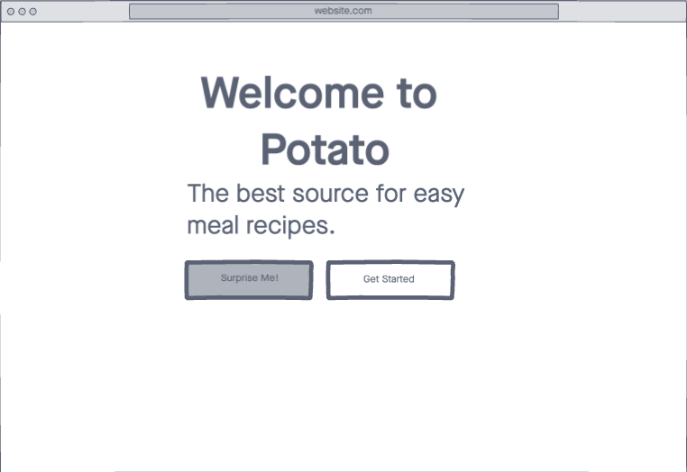
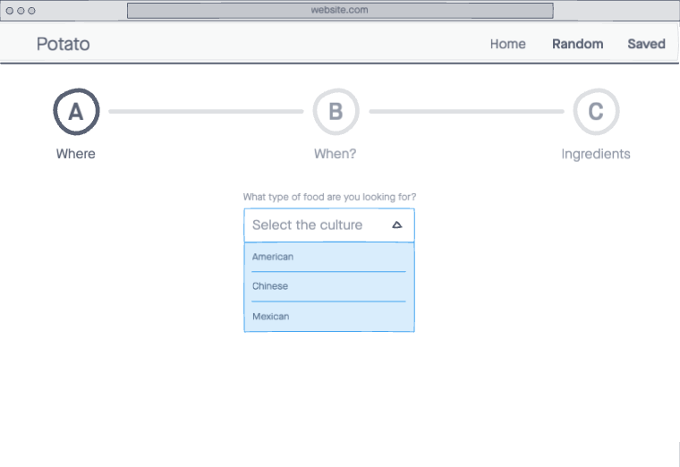
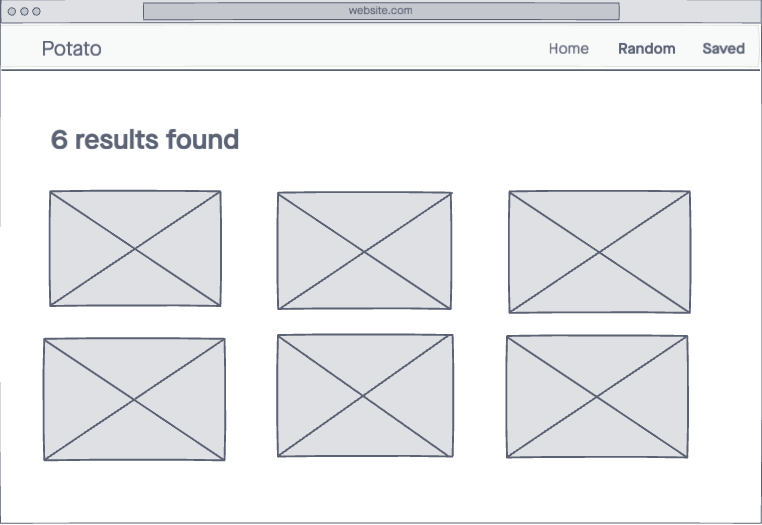
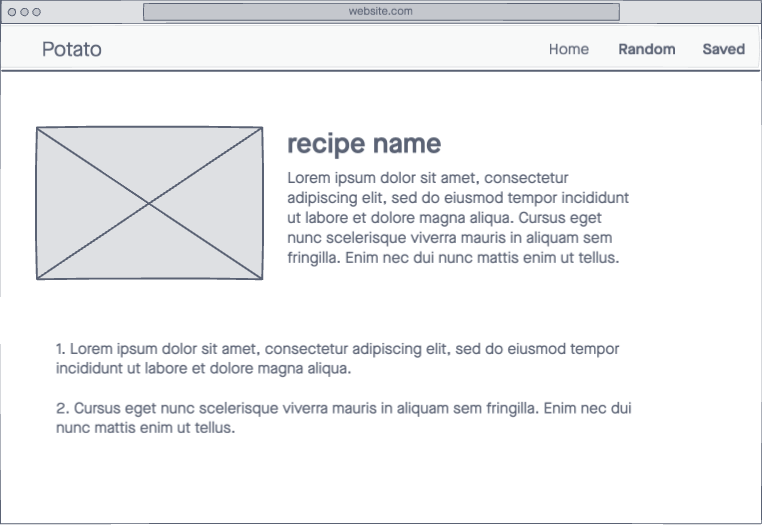

### Potato
### Details
A common problem in most households is not knowing what to eat for dinner. This program will solve that problem by providing recipe options based on the ingredients one already has or the ingredients they prefer.
This site will provide a list of recipes based on the users preferences.
The user will be able to see the recipe card and recipe information.
I would like to add a save feature to the program.
### Technology 

1. React
2. React-Bootstrap

### API Used

TheMealDB (https://www.themealdb.com/api.php)

### Wireframe

### Additional Features 

Save feature
Learning Firebase/add'l backend tools

### Tentative Timeline 
Tuesday : Figure site logic and API features
          Create site components.

Wednesday : Figure site logic and API features
          Create site components.
          Start building site layout
          CSS

Thursday : Create site components.
          Continue building site layout 
          CSS

Friday : Additional Features

Saturday : Additional Features

Sunday : 
